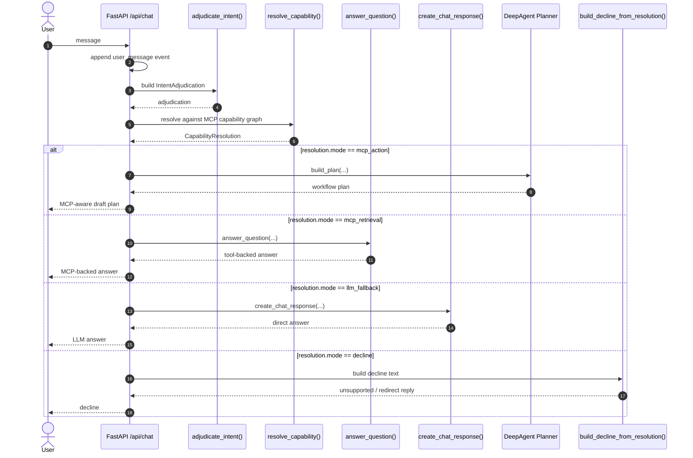

# TestCase

이 문서는 JARVIS의 현재 라우팅 구조를 설명하고, 이후 어떤 에이전트가 이어받더라도 같은 기준으로 테스트할 수 있도록 만든 스펙 문서다.

이 문서는 다음 상황을 전제로 한다.
- 컨텍스트가 끊겨도 이 문서만 읽으면 현재 라우팅 구조를 이해할 수 있어야 한다.
- Codex, Claude Code, Antigravity, OpenCode 등 다른 에이전트가 읽어도 해석 가능해야 한다.
- 이 문서의 목표는 "정답 구현"이 아니라 "현재 기대 동작과 실패 조건을 명확히 고정"하는 것이다.

실행 가능한 대응 테스트 파일은 [`backend/tests/test_routing_spec.py`](/Users/ppillip/Projects/NiceCodex/backend/tests/test_routing_spec.py)이고, 기본 실행 명령은 `cd backend && pytest -q`다.

---

## 1. Current Routing Sequence

현재 소스 기준 핵심 분기 함수:
- [`adjudicate_intent()`](/Users/ppillip/Projects/NiceCodex/backend/app/intent_router.py)
- [`resolve_capability()`](/Users/ppillip/Projects/NiceCodex/backend/app/capability_resolver.py)
- [`answer_question()`](/Users/ppillip/Projects/NiceCodex/backend/app/tool_answer_runtime.py)
- [`create_chat_response()`](/Users/ppillip/Projects/NiceCodex/backend/app/main.py)
- [`build_decline_from_resolution()`](/Users/ppillip/Projects/NiceCodex/backend/app/fallback_policy.py)
- planner path:
  [`build_plan()`](/Users/ppillip/Projects/NiceCodex/backend/app/deepagent_planner_runtime.py)



---

## 2. Agent Handoff Guide

다른 에이전트가 이 문서를 읽고 작업할 때 반드시 지켜야 할 해석 원칙:

1. `adjudication`과 `resolution`을 구분해서 보라.
- adjudication은 요청의 성격 해석이다.
- resolution은 현재 MCP capability로 실제 처리 가능한지 판단하는 단계다.

2. 라우팅 오동작을 볼 때, 먼저 어느 층이 잘못됐는지 분리하라.
- `adjudication` 오류
- `capability resolution` 오류
- `tool executor` 오류
- `LLM fallback policy` 오류

3. 문자열 룰을 무한정 추가하지 마라.
- 새 키워드 분기보다
- 판단축 보강
- capability graph 보강
- tool executor 보강
순으로 해결하라.

4. 사용자가 처리 수단을 명시하면 그것을 우선 해석하라.
- 예: `LLM한테 물어봐라`
- 예: `MCP로 처리해라`

5. 기본 정책은 다음 순서다.
- 정책상 금지면 decline
- MCP가 더 직접적으로 해결 가능하면 MCP
- MCP가 없거나 적절하지 않으면 LLM fallback
- 둘 다 아니면 decline

6. 테스트 문장은 "정답 문구 완전일치"보다 "경로와 의미"를 검증하라.
- 예: `mcp_retrieval`인지
- 예: `llm_fallback`인지
- 예: 거절이 나오지 않아야 하는지

---

## 3. Pytest-Style Spec

아래는 다른 에이전트가 pytest로 옮기기 쉽게 만든 준-스펙이다.

```python
"""
Spec target:
    backend/app/intent_router.py
    backend/app/capability_resolver.py
    backend/app/tool_answer_runtime.py
    backend/app/main.py

Core contract:
    1. adjudicate_intent() builds interpretation memo only
    2. resolve_capability() decides executable path
    3. final mode must be one of:
       - mcp_action
       - mcp_retrieval
       - llm_fallback
       - decline
"""


def test_informational_question_falls_back_to_llm():
    """
    Given:
        question = "대한민국은 어떤 나라인가?"
    Expect:
        adjudication.task_nature == "informational"
        resolution.mode == "llm_fallback"
    Fail if:
        planner path or decline path is selected
    """


def test_common_knowledge_current_person_question_should_not_decline():
    """
    Given:
        question = "미국 대통령이 누구인가?"
    Expect:
        resolution.mode == "llm_fallback"
    Fail if:
        decline or mcp_retrieval is selected
    """


def test_law_lookup_should_use_korean_law_mcp():
    """
    Given:
        question = "민법 제1조를 찾아서 알려줘라."
    Expect:
        adjudication.task_nature == "retrieval"
        "law.lookup" in resolution.required_capabilities
        resolution.mode == "mcp_retrieval"
        resolution.selected_mcp_id == "korean_law"
    Fail if:
        llm_fallback or decline is selected
    """


def test_local_filesystem_directory_count_should_use_filesystem_mcp():
    """
    Given:
        question = "지금 내 다운로드 폴더에 하위 폴더는 몇개일까요?"
    Expect:
        resolution.mode == "mcp_retrieval"
        resolution.selected_mcp_id == "filesystem"
        "filesystem.read" in resolution.required_capabilities
    Fail if:
        llm_fallback or decline is selected
    """


def test_local_filesystem_file_count_should_use_filesystem_mcp():
    """
    Given:
        question = "내 다운로드 폴더에 있는 파일이 총 몇개인지 보고하라"
    Expect:
        resolution.mode == "mcp_retrieval"
        resolution.selected_mcp_id == "filesystem"
    Fail if:
        llm_fallback or decline is selected
    """


def test_user_explicitly_requests_llm_handler():
    """
    Given:
        question = "오늘 서울의 오후 3시 날씨는 어떤지 LLM한테 물어봐라"
    Expect:
        adjudication.preferred_handler == "llm"
        resolution.mode == "llm_fallback"
    Fail if:
        decline or mcp_retrieval is selected
    """


def test_weather_without_capability_may_decline():
    """
    Given:
        question = "서울 날씨를 알려줘라"
    Expect:
        with current capability set, decline is acceptable
    Fail if:
        fabricated MCP-backed result is returned
    """


def test_real_modification_request_should_go_to_action_path():
    """
    Given:
        question = "로그인 화면 문구를 수정해라"
    Expect:
        adjudication.task_nature == "action"
        resolution.mode == "mcp_action"
    Fail if:
        llm_fallback is selected
    """
```

---

## 4. Human-Readable Cases

### Case 1
- 질문: `대한민국은 어떤 나라인가?`
- 의도: 일반 설명형 질문
- 기대 경로: `informational -> llm_fallback`
- 예상 답안: 대한민국의 위치, 정치 체제, 경제/문화 특징 설명
- 성공 기준: 플랜 없이 바로 답변
- 실패 기준: MCP 필요 또는 계획 생성

### Case 2
- 질문: `미국 대통령이 누구인가?`
- 의도: 상식형 현재 인물 질문
- 기대 경로: `informational -> llm_fallback`
- 예상 답안: 일반 LLM 답변
- 성공 기준: capability 부족을 이유로 거절하지 않음
- 실패 기준: MCP 조회 필요하다고 거절

### Case 3
- 질문: `오늘 기준 미국 대통령은 누구야?`
- 의도: 최신성 뉘앙스가 있지만 explicit tool 요구는 없음
- 기대 경로: 현재 소스 로직상 `llm_fallback`
- 예상 답안: LLM 답변, 필요하면 불확실성 짧게 언급
- 성공 기준: decline 없이 답변
- 실패 기준: MCP 부재만으로 거절

### Case 4
- 질문: `민법 제1조를 찾아서 알려줘라.`
- 의도: 법령 조회형 질문
- 기대 경로: `retrieval -> mcp_retrieval(korean_law)`
- 예상 답안: 민법 제1조 내용을 근거 중심으로 전달
- 성공 기준: 법령 MCP 사용
- 실패 기준: 일반 LLM 답변만 하거나 거절

### Case 5
- 질문: `지금 내 다운로드 폴더에 하위 폴더는 몇개일까요?`
- 의도: 로컬 파일시스템 상태 조회
- 기대 경로: `mcp_retrieval(filesystem)`
- 예상 답안: 다운로드 폴더 하위 폴더 개수
- 성공 기준: filesystem 조회 결과를 숫자로 보고
- 실패 기준: `직접 처리할 수 없습니다`라고 거절

### Case 6
- 질문: `내 다운로드 폴더에 있는 파일이 총 몇개인지 보고하라`
- 의도: 로컬 파일시스템 파일 개수 조회
- 기대 경로: `mcp_retrieval(filesystem)`
- 예상 답안: 파일 개수를 숫자로 보고
- 성공 기준: filesystem 조회 후 결과를 말함
- 실패 기준: 계획 생성 또는 거절

### Case 7
- 질문: `오늘 서울의 오후 3시 날씨는 어떤지 LLM한테 물어봐라`
- 의도: 사용자 지정 처리 수단 우선
- 기대 경로: `preferred_handler=llm -> llm_fallback`
- 예상 답안: LLM이 추정/일반 답변
- 성공 기준: MCP capability 부족을 이유로 거절하지 않음
- 실패 기준: `retrieval capability가 없다`고 답함

### Case 8
- 질문: `서울 날씨를 알려줘라`
- 의도: 실시간 날씨 조회
- 기대 경로: 현재 소스 로직상 `decline` 허용
- 예상 답안: 현재 기능 범위로는 직접 조회 불가 안내
- 성공 기준: 없는 MCP를 가정하지 않음
- 실패 기준: 허위 조회 결과 생성

### Case 9
- 질문: `로그인 화면 문구를 수정해라`
- 의도: 실제 상태 변경 작업
- 기대 경로: `action -> mcp_action -> planner`
- 예상 답안: MCP-aware 플랜 초안
- 성공 기준: review 단계 workflow 생성
- 실패 기준: 일반 설명 답변으로 종료

### Case 10
- 질문: `왼쪽 패널에 이전 대화 목록을 보여줘라`
- 의도: 제품/코드 수정 작업
- 기대 경로: `mcp_action`
- 예상 답안: 플랜 초안 또는 실제 구현 흐름
- 성공 기준: action 경로 분기
- 실패 기준: 일반 Q&A처럼 설명만 하고 종료

---

## 5. Regression Focus

- `상식형 질문`은 MCP가 없더라도 기본적으로 `llm_fallback` 가능해야 한다.
- `법령 조회`는 `korean_law` MCP가 있으면 `mcp_retrieval`로 가야 한다.
- `로컬 파일시스템 조회`는 `filesystem` MCP가 있으면 `mcp_retrieval`로 가야 한다.
- `사용자가 LLM 처리`를 명시하면 MCP보다 그 의도가 우선해야 한다.
- `실제 수정/실행 요청`은 direct answer가 아니라 planner 경로로 가야 한다.
- `실시간 외부 조회`는 MCP도 없고 override도 없으면 decline이 가능하다.

---

## 6. Current Known Risks

- `filesystem` retrieval는 resolution은 잡아도, 실제 tool-answer 품질은 filesystem micro-planner prompt 품질에 영향받는다.
- `오늘 기준` 같은 최신성 표현은 현재 기본적으로 LLM fallback이 가능하도록 남아 있다.
- `weather.read`, `finance.read`, `general_web_lookup` 같은 retrieval capability는 아직 실제 MCP로 연결되어 있지 않다.
- `browser.read` retrieval path는 아직 미구현이다.
- LLM adjudicator가 특정 케이스를 놓쳐도 resolver fallback이 구조적으로 보완하도록 설계됐지만, 완전하지는 않다.
